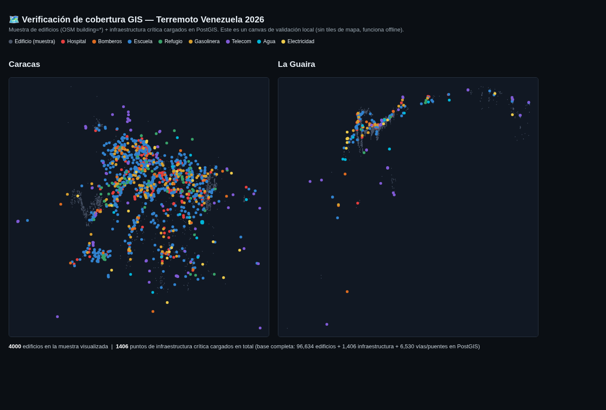
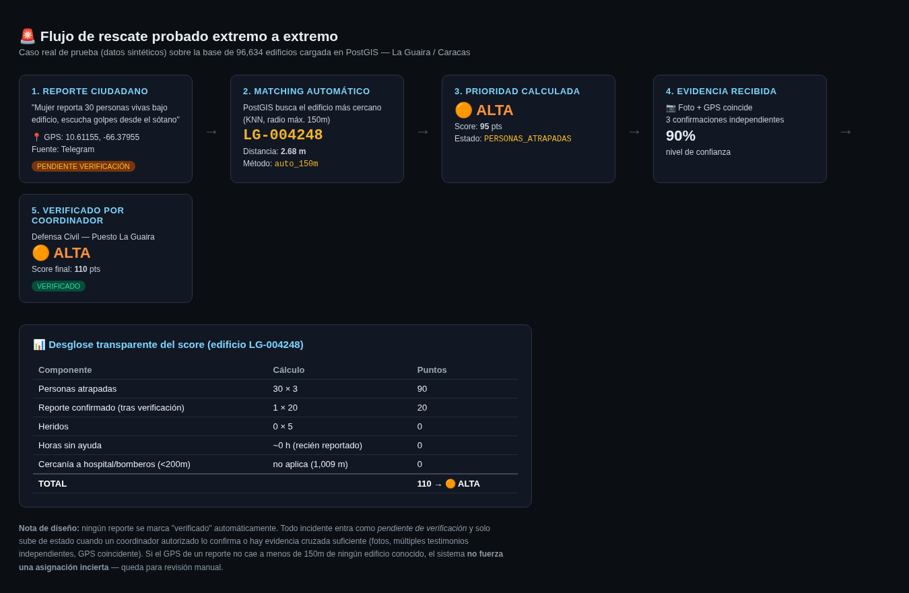

# 🇻🇪 RescueGIS — La Guaira / Caracas (Demo)

**Motor open-source de matching y priorización de reportes de rescate, sobre una base de 96,634 edificios reales.**

Construido en respuesta al terremoto de Venezuela del 24 de junio de 2026 (doblete sísmico Mw 7.2 / 7.5, Yaracuy).

---

## ¿Qué hace esto en 30 segundos?

1. Descarga **todos los edificios** de una zona desde OpenStreetMap (gratis, sin API key).
2. Cuando llega un reporte ciudadano con GPS ("hay gente atrapada aquí"), lo **vincula automáticamente** al edificio más cercano — sin adivinar, con un radio máximo de 150 metros.
3. Calcula una **prioridad transparente** (no una caja negra) para que un coordinador sepa qué atender primero.
4. Todo reporte queda como *pendiente de verificación* hasta que un humano o evidencia cruzada lo confirme.





---

## ¿Por qué existe esto?

Ya existen varias plataformas ciudadanas activas para esta emergencia
(terremotovenezuela.app, venezuela-ayuda, y el trabajo coordinado de
[HOT — Humanitarian OpenStreetMap Team](https://www.hotosm.org/en/projects/2026-venezuela-earthquake-response/)
con IOM, MapAction e iMMAP). **Este proyecto no busca ser "otro mapa más".**

Es un módulo específico —el matching GPS→edificio y la fórmula de
priorización— pensado para **integrarse** en proyectos ya activos, o servir
de referencia abierta a cualquier equipo que lo necesite. Ver
[`docs/ARQUITECTURA.md`](docs/ARQUITECTURA.md) para el detalle técnico de por
qué está separado así.

## Estado actual

- ✅ Base geográfica: 101,568 edificios + 1,406 puntos de infraestructura crítica + 6,543 vías/puentes (La Guaira + Caracas, refresco OSM 2026-07-02).
- ✅ Modelo de rescate: incidentes, evidencias, matching automático, prioridad transparente — probado extremo a extremo.
- ✅ **Conector federado SOS Venezuela 2026** (`scripts/connector_sosvenezuela.py` + `sql/03_conector_sosvenezuela.sql`): ingesta de su API pública `GET /api/reports` con dedupe por `(fuente, id_externo)`, manejo de coordenadas truncadas por privacidad (`coord_precision_m` → `match_aproximado` cuando la precisión es >60 m) y su verificación comunitaria/oficial convertida en *evidencia* (confianza 60/85), nunca en verificación automática. Probado con fixture que replica exactamente su degradación de privacidad (`tests/generar_fixture_sos.py`).
- ✅ **API propia** (`api/main.py`, FastAPI): capta reportes (`POST /api/v1/reportes`) y entrega
  información priorizada a cualquier cuerpo de emergencia — lectura pública con coordenadas
  degradadas por privacidad, precisión completa + despacho/verificación/exportes GeoJSON-CSV
  con API key por roles (emergencia/ingesta/socio), todo auditado en `api_log`.
  Guía de despliegue: [`docs/DESPLIEGUE_API.md`](docs/DESPLIEGUE_API.md).
- ✅ **Bot de Telegram** (`bot/telegram_bot.py`): un ciudadano reporta en ~30 s
  (ubicación GPS + 3 preguntas con botones) y el reporte cae matcheado y priorizado
  en la cola vía la API (key `ingesta`). Sin librerías de bot, solo `requests`;
  probado con `--simular`. Guía: [`docs/BOT_TELEGRAM.md`](docs/BOT_TELEGRAM.md).
- ⏳ Panel de coordinación (mapa Leaflet).

### Conector SOS Venezuela — uso

```bash
cd scripts
python3 connector_sosvenezuela.py             # API en vivo (1 request por corrida, respeta su rate limit)
python3 connector_sosvenezuela.py --dry-run   # transforma sin escribir
python3 connector_sosvenezuela.py --from-file ../data/sos_reports_XXXX.json  # desde cache

# Si su API está caída: watcher que ingiere automáticamente en cuanto vuelva
python3 watch_sosvenezuela.py                 # sondea cada 5 min, indefinido
python3 watch_sosvenezuela.py --once          # 1 chequeo (ideal cron: exit 0=ingirió, 1=caída)
# cron sugerido: */10 * * * * flock -n /tmp/sos.lock python3 watch_sosvenezuela.py --once

# Regenerar el panel HTML tras cada ingesta
python3 generar_panel.py
```

El panel incluye, por cada incidente `match_aproximado`, enlaces de **confirmación visual**
con fotos abiertas a nivel de calle (Mapillary / KartaView) y contexto OSM del edificio
candidato — la forma más rápida de confirmar o descartar un match sin desplazar un equipo.
Los enlaces usan la coordenada pública OSM del edificio, nunca la del reporte (que ya viene
degradada por privacidad y así se mantiene).

Atribución de datos de incidentes: **SOS Venezuela 2026** (sosvenezuela2026.com, API abierta
para fines humanitarios). Las coordenadas de la fuente vienen con jitter de 80–250 m y redondeo
a 3 decimales (anti-saqueo); este conector **no** intenta desanonimizarlas — registra la
precisión estimada y degrada el match a `match_aproximado`, que exige confirmación humana.
Panel de resultados: `docs/panel_conector_sosvenezuela.html` (standalone, offline).

## Instalación rápida

```bash
git clone <URL-de-este-repo>
cd RescueGIS-LaGuaira-Caracas
cp .env.example .env    # define tu contraseña de Postgres
pip install -r requirements.txt
cd docker && docker compose up -d && cd ..
export $(cat .env | xargs)
psql -h $PGHOST -U $PGUSER -d $PGDATABASE -f sql/01_schema.sql
psql -h $PGHOST -U $PGUSER -d $PGDATABASE -f sql/02_modelo_rescate.sql
cd scripts && python3 load_buildings.py la_guaira
```

Guía completa, con la descarga del inventario real de 96k edificios: [`docs/INSTALACION.md`](docs/INSTALACION.md).

## La fórmula de prioridad (resumen)

```
score = (personas_atrapadas   × 3)  + (heridos × 5)  + (fallecidos × 2)
      + (horas_sin_ayuda, tope 48h) + (confirmados × 20) + (pendientes × 5)
      + 15 si es infraestructura crítica + 10 si hospital/bomberos <200m
```

🔴 CRÍTICA ≥120 · 🟠 ALTA ≥60 · 🟡 MEDIA ≥20 · 🟢 BAJA <20

Cada componente es visible y auditable. **Es una ayuda a la decisión, nunca
un reemplazo del criterio de un coordinador humano.** Detalle completo con
ejemplo reproducible: [`docs/EJEMPLO_DE_REPORTE.md`](docs/EJEMPLO_DE_REPORTE.md).

## Qué NO incluye este repositorio

- Ningún dato de personas reales, teléfonos, ni ubicaciones de rescates en curso.
- Ninguna credencial ni token real.
- Ver [`SECURITY.md`](SECURITY.md) y [`CONTRIBUTING.md`](CONTRIBUTING.md) para las reglas exactas.

## Stack técnico

PostgreSQL 17 + PostGIS 3.5 · Python 3 (ingesta) · OpenStreetMap / Overpass API
· Leaflet (mapa, próximo paso) · Telegram Bot API (próximo paso)

## Estructura del repositorio

```
sql/            esquema PostGIS + modelo de rescate (dos migraciones)
scripts/        ingesta Overpass → PostGIS, precómputo de distancias
data_samples/   muestra pública de 500 edificios (para probar sin Overpass)
docs/           arquitectura, ejemplo de reporte, instalación, capturas
docker/         docker-compose para levantar PostGIS en un comando
```

## Contribuir

Lee [`CONTRIBUTING.md`](CONTRIBUTING.md) antes de abrir un issue o PR.

## Licencia

Código bajo MIT (ver [`LICENSE`](LICENSE)). Los datos geográficos derivados
de OpenStreetMap mantienen la licencia ODbL de OSM.

## Contacto

luis · onix969@proton.me · 
